# 21 — Blackjack AI Experiments

A repo for computer heuristics in Blackjack: three different agents — tabular
Q-learning, a rule-based Hi-Lo card counter, and a Deep Q-Network — playing
head-to-head under matched rules, plus the shared simulation engine that
makes a fair comparison between them possible.

## The core idea

Gymnasium's built-in `Blackjack-v1` environment deals every card from an
**infinite deck** (sampling with replacement). It's a clean way to learn
"textbook" basic strategy, but it makes card counting *mathematically
impossible* — there's no depleting shoe to count. That's a real gap: an
earlier version of this repo trained a neural net with a "card count" input
that was permanently hardcoded to `0`, because the environment gave it
nothing real to count.

[`common/shoe_env.py`](common/shoe_env.py) fixes that: a proper 6-deck,
no-replacement shoe with reshuffling and a running/true Hi-Lo count, wired
into the same 2-action (stand/hit) interface as the original env. That one
piece of shared infrastructure is what makes every other comparison in this
repo possible — including finally letting the neural net learn from a real
count signal.

## Headline result

Four strategies, run under matched conditions (300,000 hands each):

| Strategy | Win % | Push % | Loss % | Edge (per $ wagered) |
|---|---|---|---|---|
| **Q-Learning** (`Simple_21`, infinite deck, no count) | 42.53% | 9.59% | 47.88% | **-3.24%** |
| **Basic Strategy** (exact-EV, count-blind, 6-deck shoe) | 42.97% | 9.45% | 47.58% | **-2.51%** |
| **Hi-Lo Counting** (`CardCounting_21`, basic strategy + bet spread) | 42.97% | 9.45% | 47.58% | **-1.91%** |
| **DQN** (`NeuralNet_21`, learned count-aware play + bet spread) | 43.01% | 9.08% | 47.91% | **-1.98%** |

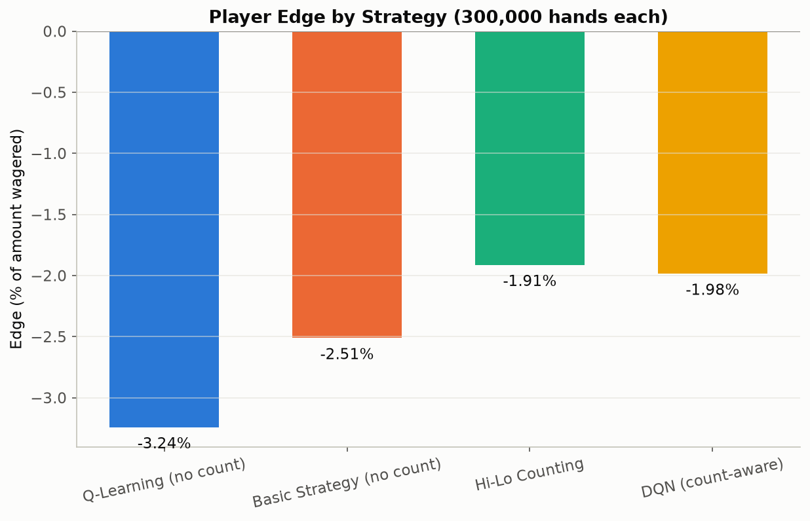
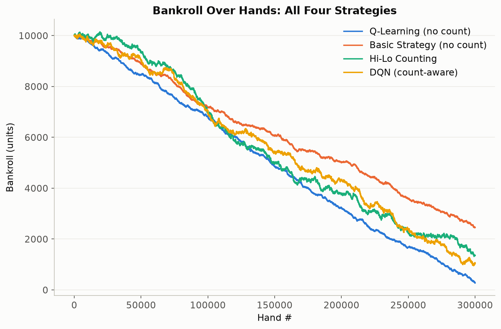

Generated by [`compare.py`](compare.py). A few things worth calling out
before you read the numbers as "counting barely helps":

- **This ruleset has no double-down or split** (matching Gymnasium's
  original 2-action environment). Real casino blackjack's ~0.5% house edge
  leans heavily on those two plays; without them, baseline edge here is a
  much steeper -2.5% to -3%. Counting still measurably closes that gap — it
  just doesn't fully overcome a harder-than-usual baseline.
- **Win rate barely moves between strategies; edge% is where counting shows
  up.** Basic Strategy and Hi-Lo play *identical* hands here (matched seed),
  so their win/push/loss rates are the same — Hi-Lo's edge improves purely
  because it bets more when the count favors the player and less when it
  doesn't.
- **Watch out reading the bankroll chart literally**: Hi-Lo and the DQN bet
  a variable 1-8 units depending on the count, so they wager *more total
  money* than the flat-bet strategies. A better edge% doesn't always mean a
  higher line on a raw bankroll chart, since more total wagering means more
  absolute swing in both directions. Edge% (return per dollar wagered) is
  the real measure of strategy quality; the table above is more trustworthy
  than eyeballing the chart.
- **The DQN doesn't quite beat the rule-based Hi-Lo counter here**, despite
  using the identical bet spread — meaning nearly all of Hi-Lo's advantage
  over Basic Strategy comes from bet sizing, not play deviations, and the
  DQN's learned play has a small residual gap to *exact*-EV basic strategy
  (visible in its strategy heatmaps below — see NeuralNet_21's notes).

## Repo structure

```
common/           Shared engine: shoe + Hi-Lo counting, exact-EV basic
                   strategy solver, DQN model/replay buffer, bankroll
                   simulator, chart styling
Simple_21/        Tabular Q-learning, infinite deck (no counting)
CardCounting_21/  Classic rule-based Hi-Lo counter (no ML)
NeuralNet_21/     DQN on the 6-deck shoe, count-aware
compare.py        Runs all of the above head-to-head, matched hands
```

Each of the three agent folders is runnable standalone (`python main.py`
from inside that folder) and writes its own charts to a local `results/`.

---

## Simple_21 — Tabular Q-Learning

Q-learning with the Bellman equation, trained on the infinite-deck env for
500,000 hands, epsilon-greedy with decay. No counting is possible here by
construction — this is the "no information edge" baseline everything else
is measured against.

```
--- Results after 10,000 games ---
Win Rate:  43.11%
Loss Rate: 47.65%
Draw Rate: 9.24%
States learned: 280
```

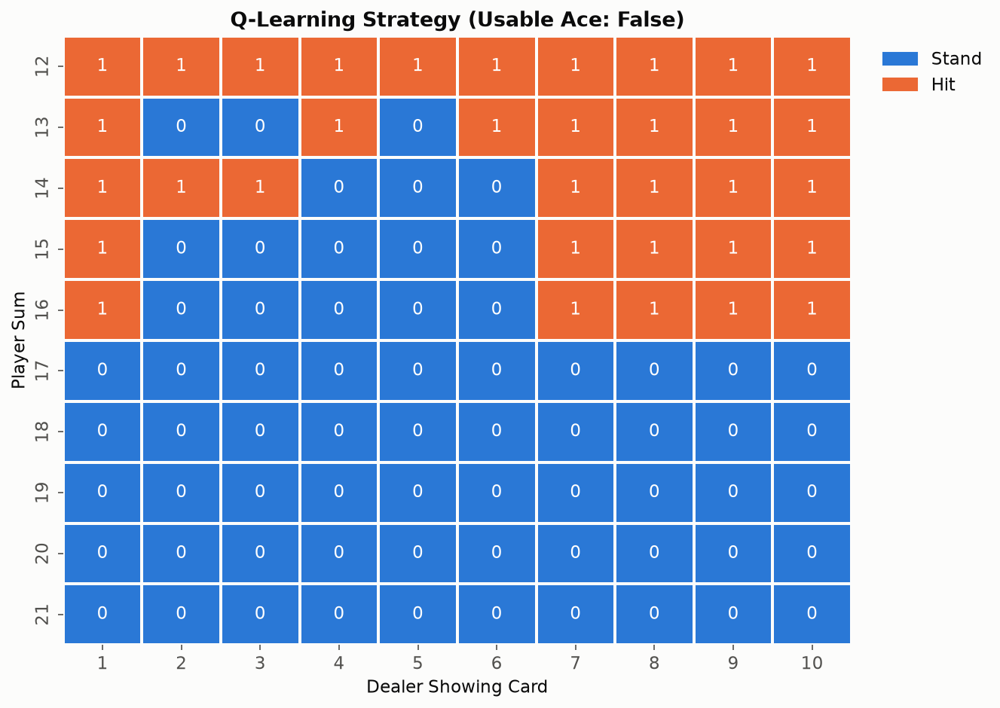
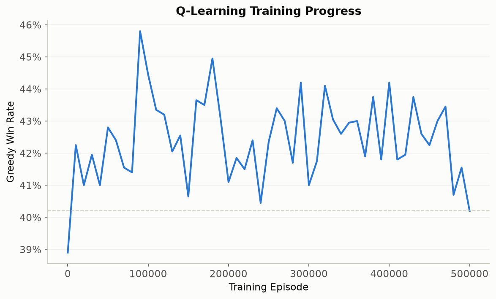

While rebuilding this, two real bugs turned up in the original training loop
(not just tuning — both are now fixed in [`train.py`](Simple_21/train.py)):

1. **The Bellman update never masked terminal transitions.** Gymnasium's
   observation after a *stand* is literally identical to the pre-stand
   state (player hand and dealer upcard don't change when you stand), so
   `next_max = max(Q(next_state))` was bootstrapping standing's value off
   the *same state's own hit-value* with no `(1 - done)` term to zero it
   out. The visible symptom: the learned policy hit on player total 17
   against several dealer cards — one of the most basic invariants in
   blackjack (always stand on 17+) was being violated.
2. **Epsilon decay was too slow to ever converge**: at the original decay
   rate, epsilon was still ~12% at the *end* of a 500,000-episode run, so
   the table kept getting noisy exploratory updates right up to the last
   episode. Fixed to reach its floor by 60% of the way through training.

After both fixes, hard totals 15-21 now match the exact optimal policy
(computed independently — see `common/basic_strategy.py` below) cell for
cell. Totals 12-14 are directionally right with some noise in the
famously-marginal cells (e.g. 12 vs. dealer 4/5/6, where hit and stand are
separated by ~1-2% EV — one of the closest calls in the entire strategy
chart). **Soft (usable-ace) totals are noisier** — soft hands are inherently
rarer in training data (you need to draw an ace), so the tabular approach
gets fewer samples per state there. Compare this to NeuralNet_21 below,
which handles the same rare states markedly better via generalization.

Run it: `cd Simple_21 && python main.py` (~1 minute; trains fresh if no
checkpoint is found).

---

## CardCounting_21 — Classic Hi-Lo Counting

No machine learning here on purpose — this is the "classic card counting"
approach: exact basic strategy for every playing decision (computed by
`common/basic_strategy.py`, see below), plus a true-count-driven bet spread
(1 unit at true count ≤ 1, scaling up to 8 units at true count ≥ 5 — a
standard 1-8 spread).

```
--- Hi-Lo spread betting (500,000 hands) ---
Win 43.0%  Push 9.4%  Loss 47.6%
Edge: -2.07%   Final bankroll: -5,472 (from 10,000, 1 unit = 1 bankroll unit)

--- Flat betting, same cards & decisions ---
Win 43.0%  Push 9.4%  Loss 47.6%
Edge: -2.58%   Final bankroll: -2,920
```

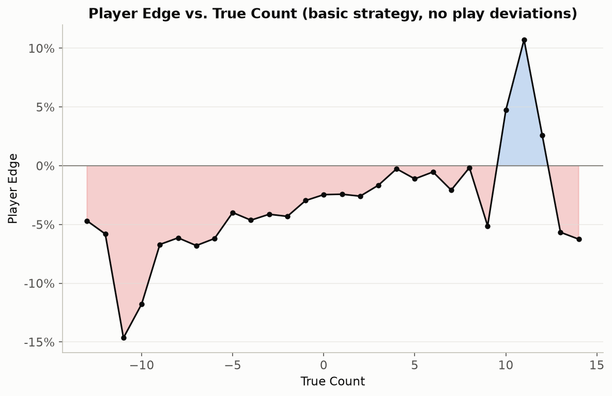

The canonical card-counting chart: player edge rises with the true count.
The crossover to a positive player edge happens way out around true count
+9 to +12, much higher than the commonly-cited "+1 to +2" for full-rules
casino blackjack — a direct consequence of this ruleset's steeper baseline
house edge (no double/split) needing a bigger count swing to overcome.
Points beyond about ±10 are noisy (a 6-deck shoe rarely reaches such extreme
counts, so those buckets have few samples even at 500,000 hands).

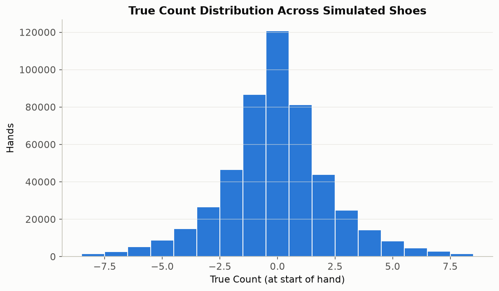
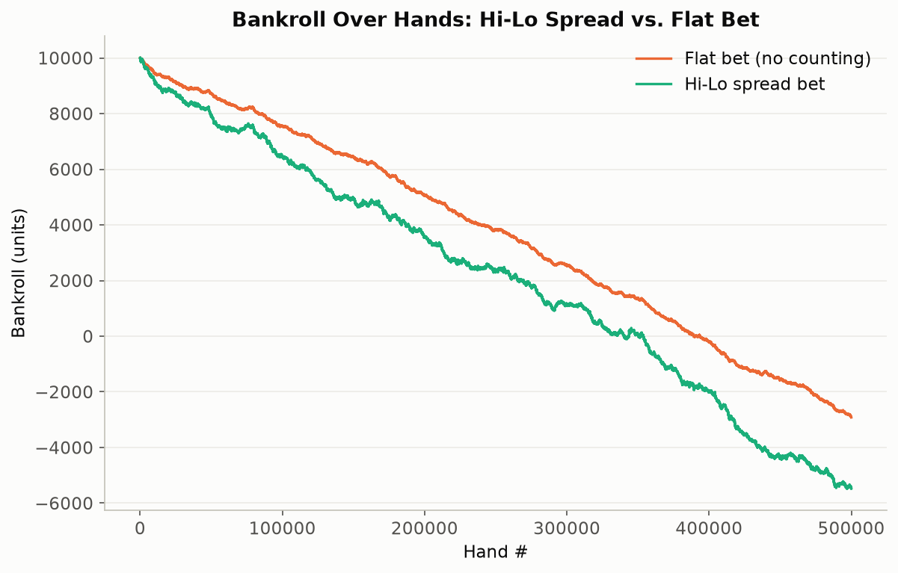

Run it: `cd CardCounting_21 && python main.py` (~20 seconds).

---

## NeuralNet_21 — Deep Q-Network

A from-scratch DQN rebuild. The original version here had two problems: no
replay buffer or target network (it did a single-sample online update every
step, which is notoriously unstable for DQN), and — as its own README used
to admit — the "card count" input was hardcoded to `0`, since the
infinite-deck environment had nothing real to count.

Both are fixed. It now trains on `common/shoe_env` (a real true-count
signal) with a proper replay buffer, a periodically-synced target network,
and Double DQN (action selection from the online net, evaluation from the
target net, which curbs the overestimation bias plain DQN is prone to).
Trained every 4th environment step rather than every step, which is what
makes 400,000 episodes finish in a few minutes on CPU instead of ~10.

```
--- Results after 10,000 games (6-deck shoe) ---
Win Rate:  43.33%
Loss Rate: 47.50%
Draw Rate: 9.17%
```

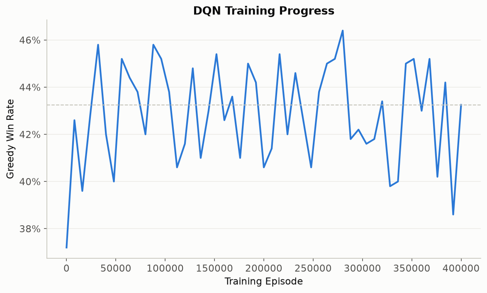
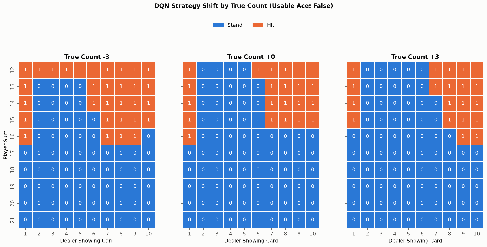

The payoff visual: the same hand can get a different action depending on
the true count. Compare the "True Count -3" panel to "+3" above — the net
learned some real count-based deviations from its own neutral-count policy,
not just a static basic-strategy lookup.

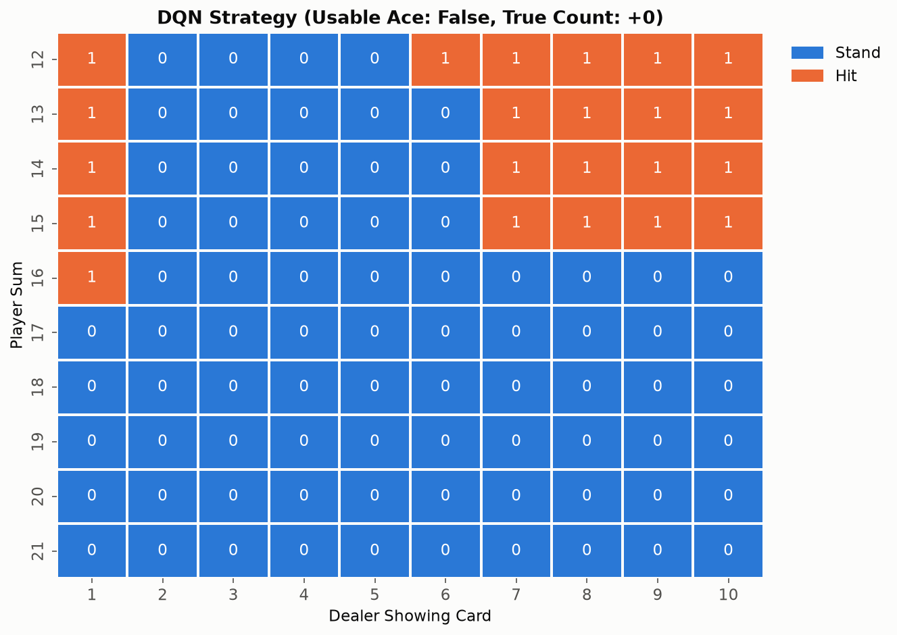
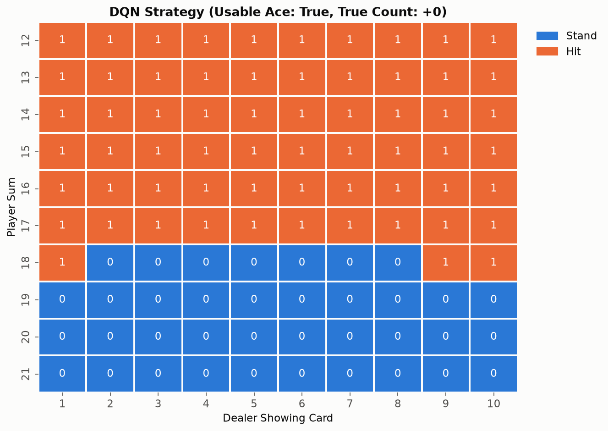

Where it's genuinely strong: **soft totals are notably better learned here
than in Simple_21's tabular table** — soft 18 exactly matches the
independently-computed optimal policy (stand vs. dealer 2-8, hit vs.
9/10/A), where the tabular agent got that same cell completely wrong. This
is the theoretical advantage of function approximation in practice: the
network generalizes across similar (sum, dealer-card, count) states instead
of needing enough direct visits to *each exact state* the way a Q-table
does.

Where it still misses: **standing on a hard 16 against a strong dealer
upcard (7-10)**, where basic strategy says hit. This survived several
rounds of debugging that did fix other things (see below) — worth explaining
rather than hand-waving away. Hitting a hard 16 busts about 62% of the time
(any card 6 or higher busts it, and tens are four times as likely as any
other rank), so it's a high-variance decision that's correct *on average*
but *looks* wrong most of the time it's sampled. That combination — real
but small EV edge, dominated by a much more common bad-looking outcome — is
a known hard case for value-based RL with a finite sample budget, distinct
from an implementation bug. (One such bug *was* found and fixed along the
way: the original discount factor of 0.95 was borrowed from the tabular
agent without reconsidering it, but a blackjack hand is a short, strictly
episodic sequence — discounting within it has no real meaning, and worse,
it systematically penalizes multi-step "hit" sequences relative to an
immediate "stand" by compounding gamma per Bellman hop. Fixed to gamma=1.0,
which visibly changed — though didn't fully resolve — this exact cell.)

Run it: `cd NeuralNet_21 && python main.py` (~6 minutes; trains fresh if no
checkpoint is found).

---

## common/ — the shared engine

- **`shoe_env.py`** — the 6-deck shoe with Hi-Lo running/true count, described above.
- **`basic_strategy.py`** — rather than transcribe a textbook basic-strategy
  chart from memory (risky: most published charts assume double-down is
  available, and cells that say "double, else stand" vs. "double, else hit"
  don't collapse to a rule you can safely guess), this **computes the exact
  optimal hit/stand policy from first principles** via expected-value
  recursion over the standard infinite-deck card distribution, memoized into
  a lookup table. It's the ground truth the other agents are compared
  against throughout this README.
- **`card_counting.py`** — the Hi-Lo tag table and the 1-8 unit bet spread.
- **`dqn_model.py`** — the network architecture and replay buffer, shared so
  `compare.py` can reconstruct the trained model without importing
  `NeuralNet_21` as a package.
- **`bankroll_sim.py`** — runs any (playing policy, bet function) pair over
  many hands and reports win/push/loss rates, edge%, and a bankroll
  trajectory. Used by every module above.
- **`plot_style.py`** — one consistent, colorblind-validated palette so a
  given strategy is always the same color across every chart in this repo.

## Ruleset, honestly

Every agent here plays a simplified 2-action game (stand/hit only — no
double-down, no split), matching the scope of Gymnasium's original
`Blackjack-v1`. That's a real ruleset simplification, not just a training
convenience: real basic strategy's double/split plays are worth a
meaningful chunk of the ~1.5-2% they add back to the player's side, so every
house-edge number in this README (-2% to -3%) is steeper than the ~0.5%
commonly cited for full-rules casino blackjack. Card counting still works
the same way and still measurably improves edge — it's just working against
a harder baseline throughout.

## Setup

```bash
conda create -n blackjack21 python=3.11
conda activate blackjack21
pip install -r requirements.txt
```

(`requirements.txt` installs the regular PyPI `torch` build. If you don't
need CUDA, `pip install torch --index-url https://download.pytorch.org/whl/cpu`
first gets you a much smaller download — everything in this repo runs
comfortably on CPU regardless.)

Then, from the repo root:

```bash
cd Simple_21 && python main.py            # ~1 min
cd ../CardCounting_21 && python main.py   # ~20 sec
cd ../NeuralNet_21 && python main.py      # ~6 min
cd .. && python compare.py                # ~1 min, needs both checkpoints above to exist
```
