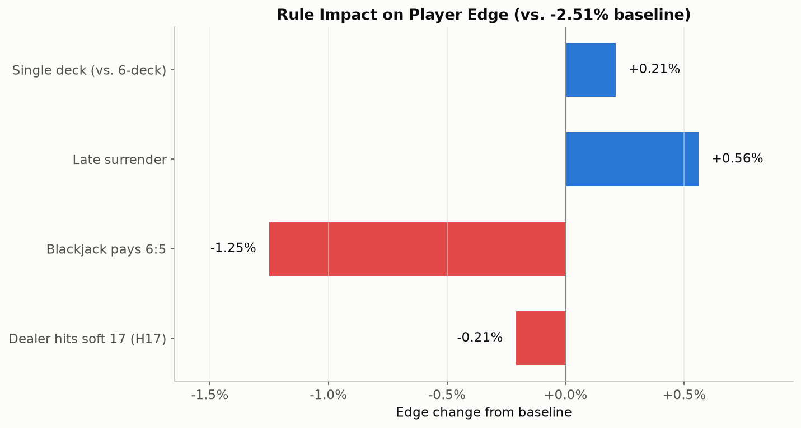
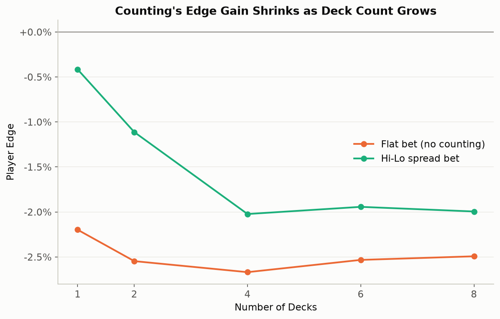

# 21 — Blackjack AI Experiments

A repo for computer heuristics in Blackjack: three different agents — tabular
Q-learning, a rule-based Hi-Lo card counter, and a Deep Q-Network — playing
head-to-head under matched rules, plus the shared simulation engine that
makes a fair comparison between them possible.

## The core idea

Gymnasium's built-in `Blackjack-v1` environment deals every card from an
**infinite deck** (sampling with replacement). It's a clean way to learn
"textbook" basic strategy, but it makes card counting *mathematically
impossible* — there's no depleting shoe to count. That's a real gap: an
earlier version of this repo trained a neural net with a "card count" input
that was permanently hardcoded to `0`, because the environment gave it
nothing real to count.

[`common/shoe_env.py`](common/shoe_env.py) fixes that: a proper 6-deck,
no-replacement shoe with reshuffling and a running/true Hi-Lo count, wired
into the same 2-action (stand/hit) interface as the original env. That one
piece of shared infrastructure is what makes every other comparison in this
repo possible — including finally letting the neural net learn from a real
count signal.

## Headline result

Five strategies, run under matched conditions (1,000,000 hands each):

| Strategy | Win % | Push % | Loss % | Edge (per $ wagered) |
|---|---|---|---|---|
| **Q-Learning** (`Simple_21`, infinite deck, no count) | 42.61% | 9.67% | 47.72% | **-3.02%** |
| **Basic Strategy** (exact-EV, count-blind, 6-deck shoe) | 42.94% | 9.46% | 47.60% | **-2.57%** |
| **Hi-Lo Counting** (`CardCounting_21`, basic strategy + bet spread) | 42.94% | 9.46% | 47.60% | **-1.86%** |
| **DQN** (`NeuralNet_21`, learned count-aware play + bet spread) | 43.03% | 9.09% | 47.87% | **-2.03%** |
| **Hi-Lo, favorable rules** (1-deck + surrender, same Hi-Lo spread) | 41.16% | 8.45% | 50.39% | **+0.58%** |


Generated by [`compare.py`](compare.py). That last row is the answer to
"shouldn't counting give the player an edge?" — yes, and here it visibly
does: same Hi-Lo strategy as row 3, only the *rules* changed (single deck +
late surrender, both real adjustable rules in `common/shoe_env.py`, still no
double-down). The bankroll chart makes it obvious — one line climbs, four
trend down. A few things worth understanding before taking any of this at
face value:

- **The other four numbers are negative, and that's the correct, expected
  result for *this repo's default* 6-deck/no-surrender ruleset — not a bug,
  and not the ceiling of what counting can do**, as row 5 shows. See "Does
  counting actually overcome the house edge here?" under `CardCounting_21`
  and `rule_impact.py` below for the full measurement behind both the
  default numbers and the favorable-rules result.
- **This ruleset has no double-down or split anywhere**, including row 5
  (matching Gymnasium's original 2-action environment). Real casino
  blackjack's ~0.5% house edge leans heavily on those two plays; without
  them, the *default*-rules baseline here is a much steeper -2.5% to -3%.
  Row 5's positive edge comes entirely from deck count and surrender, not
  from quietly adding double-down back in.
- **Row 5's win rate is actually the lowest of the five, and its loss rate
  the highest — despite having the best edge.** That's surrender doing its
  job, not a contradiction: surrendering forfeits exactly half the bet
  immediately, counted as a loss either way, on hands whose *average*
  continued-play outcome would have been worse than that half-loss even
  though many of those same hands would have gone on to win or push if
  played out. Trading away some win-rate for consistently smaller losses is
  the whole mechanism — edge%, not win rate, is what should move.
- **Win rate barely moves between the count-blind and counting strategies
  that share a ruleset; edge% is where counting shows up.** Basic Strategy
  and Hi-Lo (row 2 vs. 3) play *identical* hands (matched seed), so their
  win/push/loss rates are the same — Hi-Lo's edge improves purely because it
  bets more when the count favors the player and less when it doesn't.
- **Watch out reading the bankroll chart's other four lines literally**:
  Hi-Lo and the DQN bet a variable 1-16 units depending on the count, so
  they wager *more total money* than the flat-bet strategies. A better edge%
  doesn't always mean a higher line on a raw bankroll chart, since more
  total wagering means more absolute swing in both directions. Edge% (return
  per dollar wagered) is the real measure of strategy quality; the table
  above is more trustworthy than eyeballing those four lines against each
  other (row 5's climb is large enough that this caveat doesn't apply to it).
- **The DQN doesn't quite beat the rule-based Hi-Lo counter under the
  default rules**, despite using the identical bet spread — meaning nearly
  all of Hi-Lo's advantage over Basic Strategy comes from bet sizing, not
  play deviations, and the DQN's learned play has a small residual gap to
  *exact*-EV basic strategy (visible in its strategy heatmaps below — see
  NeuralNet_21's notes).

## Repo structure

```
common/           Shared engine: shoe + Hi-Lo counting, exact-EV basic
                   strategy solver, DQN model/replay buffer, bankroll
                   simulator, chart styling
Simple_21/        Tabular Q-learning, infinite deck (no counting)
CardCounting_21/  Classic rule-based Hi-Lo counter (no ML)
NeuralNet_21/     DQN on the 6-deck shoe, count-aware
compare.py        Runs all of the above head-to-head, matched hands
rule_impact.py    Sweeps individual blackjack rules (H17, payout, surrender,
                   deck count) to measure what each one is actually worth
```

Each of the three agent folders is runnable standalone (`python main.py`
from inside that folder) and writes its own charts to a local `results/`.

---

## Simple_21 — Tabular Q-Learning

Q-learning with the Bellman equation, trained on the infinite-deck env for
500,000 hands, epsilon-greedy with decay. No counting is possible here by
construction — this is the "no information edge" baseline everything else
is measured against.

```
--- Results after 10,000 games ---
Win Rate:  43.11%
Loss Rate: 47.65%
Draw Rate: 9.24%
States learned: 280
```


While rebuilding this, two real bugs turned up in the original training loop
(not just tuning — both are now fixed in [`train.py`](Simple_21/train.py)):

1. **The Bellman update never masked terminal transitions.** Gymnasium's
   observation after a *stand* is literally identical to the pre-stand
   state (player hand and dealer upcard don't change when you stand), so
   `next_max = max(Q(next_state))` was bootstrapping standing's value off
   the *same state's own hit-value* with no `(1 - done)` term to zero it
   out. The visible symptom: the learned policy hit on player total 17
   against several dealer cards — one of the most basic invariants in
   blackjack (always stand on 17+) was being violated.
2. **Epsilon decay was too slow to ever converge**: at the original decay
   rate, epsilon was still ~12% at the *end* of a 500,000-episode run, so
   the table kept getting noisy exploratory updates right up to the last
   episode. Fixed to reach its floor by 60% of the way through training.

After both fixes, hard totals 15-21 now match the exact optimal policy
(computed independently — see `common/basic_strategy.py` below) cell for
cell. Totals 12-14 are directionally right with some noise in the
famously-marginal cells (e.g. 12 vs. dealer 4/5/6, where hit and stand are
separated by ~1-2% EV — one of the closest calls in the entire strategy
chart). **Soft (usable-ace) totals are noisier** — soft hands are inherently
rarer in training data (you need to draw an ace), so the tabular approach
gets fewer samples per state there. Compare this to NeuralNet_21 below,
which handles the same rare states markedly better via generalization.

Run it: `cd Simple_21 && python main.py` (~1 minute; trains fresh if no
checkpoint is found).

---

## CardCounting_21 — Classic Hi-Lo Counting

No machine learning here on purpose — this is the "classic card counting"
approach: exact basic strategy for every playing decision (computed by
`common/basic_strategy.py`, see below), plus a true-count-driven bet spread
(`common/card_counting.py`).

```
--- Hi-Lo spread betting (500,000 hands) ---
Win 43.0%  Push 9.4%  Loss 47.6%
Edge: -1.97%   Final bankroll: -5,162 (from 10,000, 1 unit = 1 bankroll unit)

--- Flat betting, same cards & decisions ---
Win 43.0%  Push 9.4%  Loss 47.6%
Edge: -2.58%   Final bankroll: -2,920
```


The canonical card-counting chart: player edge rises with the true count.

### Does counting actually overcome the house edge here?

Short answer: only barely, and only on a sliver of hands — which is exactly
why the strategy-level numbers above stay negative even with a well-tuned
spread. This is worth walking through with real measurements rather than
hand-waving, because the first, naive answer I got was misleading.

The first version of `edge_vs_true_count` used 500,000 hands and a
minimum-sample-per-bucket of 30, and it made the crossover to a positive
player edge look like it happened around true count +9 to +12. That turned
out to be noise: extreme true counts are rare enough in a 6-deck shoe that
even 500k hands leaves the tail buckets with only a few dozen samples each.
Re-running at 4,000,000 hands moved the visible crossover down to around
**true count +7** — and re-running *again* at 3,000,000 hands with a
different seed shifted individual tail points around by several points
again. The honest conclusion isn't a precise crossover number; it's that
**pinning down the exact crossover is itself hard**, because a 6-deck shoe
just doesn't reach extreme counts often enough, even across millions of
simulated hands, for the tail to fully stop being noisy.

What *is* robust across every large sample: pooling all hands at true count
+7 and above (0.9-1% of all hands, consistently, across samples) gives a
player edge of **+0.01%** — essentially exactly breakeven, not a strong
edge. Real card-counting's famous positive edge leans heavily on double-down
and split (both unavailable in this 2-action ruleset) to amplify exactly
those favorable counts; without them, even the "good" counts here are only
just barely good.

That also explains why the bet spread is shaped the way it is. My first
instinct was "only bet big once the count is *actually* favorable" — flat
minimum until true count 7, then scale up. In a dedicated same-seed,
3,000,000-hand A/B test of three spreads, that instinct measured **worse**
than the original 1-8 spread (-2.40% vs. -2.02%), not better. The reason:
true counts +2 through +6 are still house-favorable, just *less*
house-favorable than average — and a spread that ramps up gradually through
that range captures real value by shifting money away from the worst counts
toward the least-bad ones, well before ever reaching a truly positive count.
`bet_units()` now combines both effects: the original gradual ramp through
true count 6, then a higher top tier (up to 16 units) to squeeze a bit more
out of the rare +7-and-up zone — measured best of the three in that same
A/B test (-1.90%), consistent with the -1.97% this module's own run above
reports on a different seed and hand count.

Points beyond about ±10 in the chart above are still noisy even at 3,000,000
hands (a 6-deck shoe rarely reaches such extreme counts) — read the overall
shape and the sign of the trend, not individual extreme-count dots.


Run it: `cd CardCounting_21 && python main.py` (~2 minutes — most of that is
the large sample the edge-vs-true-count chart needs to not be noise).

---

## rule_impact.py — how much do the rules matter?

`CardCounting_21` answers "does counting help" for this repo's *default*
ruleset. This script asks the natural follow-up: how much of that -2.5%
baseline comes from this ruleset's own choices, and is there *any*
combination of rules that gets a counter into positive territory without
adding double-down back in?

`common/shoe_env.py` now exposes three more real rule toggles on top of deck
count and penetration: `blackjack_payout` (3:2, 6:5, or any multiplier),
`dealer_hits_soft_17`, and late surrender
(`common/basic_strategy.py`'s `should_surrender()` — computed the same
exact-EV way as everything else here: surrender is correct exactly when
continuing's best available EV is worse than the guaranteed -0.5 EV of
forfeiting the hand).



Each bar is this repo's own measured edge delta from flipping one rule,
against [Wizard of Odds' published deltas](https://wizardofodds.com/games/blackjack/rule-variations/)
for the same rules (measured against a *full-rules*, double/split-available
baseline, so exact agreement isn't expected):

| Rule | Measured here | Wizard of Odds (full rules) |
|---|---|---|
| Dealer hits soft 17 | -0.21% | -0.22% |
| Blackjack pays 6:5 | -1.25% | -1.39% |
| Single deck (vs. 6-deck) | +0.21% (+0.37% at a larger 2M-hand sample) | +0.46% |
| Late surrender | **+0.56%** | +0.07% to +0.24% |

Three of four land close to the published numbers — reassuring, since it
means the simulation is measuring what it claims to. Surrender is the one
real exception, and it's explainable rather than a red flag: published
surrender numbers are small *because* double-down and split already rescue
most of the hands that would otherwise need it. Take those options away and
surrender is left to salvage value from a much wider range of bad hands on
its own — this repo's exact solver finds it's correct on totals as high as
hard 17 against a dealer ace, well beyond a standard surrender chart. (An
earlier pass at 300,000 hands made H17 and deck count look similarly
"suppressed" by the missing double-down, which would have been a tidy
unifying story — except it was wrong. Re-run at 2,000,000 hands, both landed
right back on the published numbers. Only surrender's gap held up at the
larger sample, which is what makes it a real finding rather than noise that
happened to fit a nice narrative.)

### So, can we get to positive without double-down?

Yes — barely, and only by stacking every favorable lever this ruleset has at
once: a single deck, surrender, and Hi-Lo spread betting. Measured across
three independent 2,000,000-hand runs:

```
Best case (1-deck, S17, 3:2, surrender, Hi-Lo spread):
  seed=1: edge=+0.386%
  seed=2: edge=+0.552%
  seed=3: edge=+0.315%
```

Consistently positive — in the same ballpark as real-world single-deck
advantage play. The worst combination of the same levers (8 decks, H17,
6:5, no surrender, flat bet) comes out to -3.95%: roughly a 4.3-point swing
in player edge from rule choices alone, before any skill the player brings.



The deck-count sweep shows the more standard reason advantage players
actually care about deck count: it barely moves the flat-bet *baseline*
(orange, nearly flat across 1-8 decks), but it visibly changes how much
*counting adds* on top (the gap to the green Hi-Lo line) — fewer decks means
the true count swings harder per card removed, so the same bet spread
extracts more value. That's why single- and double-deck games are the ones
real counters seek out, and why casinos that still spread them tend to
shuffle earlier specifically to blunt this effect.

Run it: `python rule_impact.py` from the repo root (~2-3 minutes).

---

## NeuralNet_21 — Deep Q-Network

A from-scratch DQN rebuild. The original version here had two problems: no
replay buffer or target network (it did a single-sample online update every
step, which is notoriously unstable for DQN), and — as its own README used
to admit — the "card count" input was hardcoded to `0`, since the
infinite-deck environment had nothing real to count.

Both are fixed. It now trains on `common/shoe_env` (a real true-count
signal) with a proper replay buffer, a periodically-synced target network,
and Double DQN (action selection from the online net, evaluation from the
target net, which curbs the overestimation bias plain DQN is prone to).
Trained every 4th environment step rather than every step, which is what
makes 400,000 episodes finish in a few minutes on CPU instead of ~10.

```
--- Results after 10,000 games (6-deck shoe) ---
Win Rate:  43.33%
Loss Rate: 47.50%
Draw Rate: 9.17%
```


The payoff visual: the same hand can get a different action depending on
the true count. Compare the "True Count -3" panel to "+3" above — the net
learned some real count-based deviations from its own neutral-count policy,
not just a static basic-strategy lookup.


Where it's genuinely strong: **soft totals are notably better learned here
than in Simple_21's tabular table** — soft 18 exactly matches the
independently-computed optimal policy (stand vs. dealer 2-8, hit vs.
9/10/A), where the tabular agent got that same cell completely wrong. This
is the theoretical advantage of function approximation in practice: the
network generalizes across similar (sum, dealer-card, count) states instead
of needing enough direct visits to *each exact state* the way a Q-table
does.

Where it still misses: **standing on a hard 16 against a strong dealer
upcard (7-10)**, where basic strategy says hit. This survived several
rounds of debugging that did fix other things (see below) — worth explaining
rather than hand-waving away. Hitting a hard 16 busts about 62% of the time
(any card 6 or higher busts it, and tens are four times as likely as any
other rank), so it's a high-variance decision that's correct *on average*
but *looks* wrong most of the time it's sampled. That combination — real
but small EV edge, dominated by a much more common bad-looking outcome — is
a known hard case for value-based RL with a finite sample budget, distinct
from an implementation bug. (One such bug *was* found and fixed along the
way: the original discount factor of 0.95 was borrowed from the tabular
agent without reconsidering it, but a blackjack hand is a short, strictly
episodic sequence — discounting within it has no real meaning, and worse,
it systematically penalizes multi-step "hit" sequences relative to an
immediate "stand" by compounding gamma per Bellman hop. Fixed to gamma=1.0,
which visibly changed — though didn't fully resolve — this exact cell.)

Run it: `cd NeuralNet_21 && python main.py` (~6 minutes; trains fresh if no
checkpoint is found).

---

## common/ — the shared engine

- **`shoe_env.py`** — the 6-deck shoe with Hi-Lo running/true count, described
  above. Deck count, penetration, blackjack payout (3:2/6:5/any multiplier),
  and dealer hit/stand-on-soft-17 are all constructor parameters — see
  `rule_impact.py` for how much each one actually matters.
- **`basic_strategy.py`** — rather than transcribe a textbook basic-strategy
  chart from memory (risky: most published charts assume double-down is
  available, and cells that say "double, else stand" vs. "double, else hit"
  don't collapse to a rule you can safely guess), this **computes the exact
  optimal hit/stand policy from first principles** via expected-value
  recursion over the standard infinite-deck card distribution, memoized into
  a lookup table. It's the ground truth the other agents are compared
  against throughout this README. Also computes the exact optimal late-
  surrender decision the same way (`should_surrender()`), and supports
  computing both under dealer-stands-soft-17 and dealer-hits-soft-17 — which
  turn out to select the *identical* action on all 360 cells in this
  2-action ruleset (H17 only changes double-down decisions, which don't
  exist here), a useful, verified simplification for `rule_impact.py`.
- **`card_counting.py`** — the Hi-Lo tag table and the bet spread (1-16
  units, empirically tuned against a multi-million-hand simulation rather
  than assumed — see "Does counting actually overcome the house edge here?"
  under `CardCounting_21` above).
- **`dqn_model.py`** — the network architecture and replay buffer, shared so
  `compare.py` can reconstruct the trained model without importing
  `NeuralNet_21` as a package.
- **`bankroll_sim.py`** — runs any (playing policy, bet function) pair over
  many hands and reports win/push/loss rates, edge%, and a bankroll
  trajectory. Used by every module above. Takes an optional surrender
  function, checked once right after the deal, before any play decision.
- **`plot_style.py`** — one consistent, colorblind-validated palette so a
  given strategy is always the same color across every chart in this repo.

## Ruleset, honestly

Every agent here plays a simplified 2-action game (stand/hit only — no
double-down, no split), matching the scope of Gymnasium's original
`Blackjack-v1`. That's a real ruleset simplification, not just a training
convenience: per [Wizard of Odds](https://wizardofodds.com/games/blackjack/rule-variations/),
no-double alone costs -1.48% and no-split another -0.57% — accounting for
almost exactly the gap between this repo's -2.5% baseline and the ~0.5%
commonly cited for full-rules casino blackjack.

Deck count, penetration, dealer hit/stand-on-soft-17, blackjack payout, and
late surrender are *not* simplified away — they're real, independently
adjustable rules (`common/shoe_env.py`, `common/basic_strategy.py`), and
`rule_impact.py` measures exactly what each one is worth, including a
combination that gets this ruleset to a genuine, verified positive edge
without ever adding double-down back in. Double-down and split themselves
remain the one true gap: adding them would mean a 3rd/4th action, a bigger
basic-strategy solver, and retraining both RL agents from scratch — out of
scope for now, but the biggest lever left if this repo grows further.

## Setup

```bash
conda create -n blackjack21 python=3.11
conda activate blackjack21
pip install -r requirements.txt
```

(`requirements.txt` installs the regular PyPI `torch` build. If you don't
need CUDA, `pip install torch --index-url https://download.pytorch.org/whl/cpu`
first gets you a much smaller download — everything in this repo runs
comfortably on CPU regardless.)

Then, from the repo root:

```bash
cd Simple_21 && python main.py            # ~1 min
cd ../CardCounting_21 && python main.py   # ~2 min
cd ../NeuralNet_21 && python main.py      # ~6 min
cd .. && python compare.py                # ~1 min, needs both checkpoints above to exist
python rule_impact.py                     # ~2-3 min, independent of the above
```
